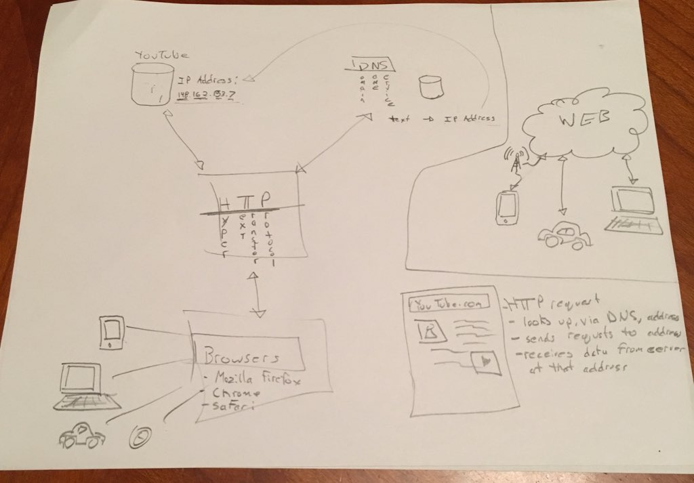

> IMPORTANT! Completed tasks are evaluate at the final result and the manner of applying the knowledge gained in the  course 

### Required reading  
http://docs.oracle.com/javase/tutorial/networking/overview/networking.html   
http://docs.oracle.com/javase/tutorial/networking/urls/index.html  
http://docs.oracle.com/javase/tutorial/networking/sockets/index.html  
https://github.com/google/guava/wiki/ServiceExplained  

### Testing Tips
http://blog.thecodewhisperer.com/permalink/beyond-mock-objects  

Books:
- Network+ Guide to Networks,Fifth Edition - Chapter2
- Growing Object-Oriented Software -Chapter 26 Unit Testing and Threads
- Java Network Programming, 4th Edition 

### Задачи  
1. Да се реализира DownloadAgent. Класът DownloadAgent има метод downloаdFile(), чиято роля  е да позволява да се смъкват различни файлове от интернет (да се погледнат класовете URL и URLConnection).  
 * Тестване
   * Задачата трябва да се тества автоматизирано и изолирано от всякакъв environment (дори и интернет) с юнит тестове. Трябва да се провери както цялостта на смъкнатите файлове, така и начина по - който прогреса се обновява.  
2. Разговор между клиент и сървър. Сървъра е инстанция на ServerSocket, а клиента - на Socket.  
 * Какво прави сървъра
   * Стартира се на определен порт, на host- localhost.  
   * Приема клиента чрез метода accept().  
   * Изпраща по изходния поток на сокета на клиента съобщението: "Hello!" + <системната дата>.     
 * Какво прави клиента:  
   * Свързва се към сървъра на определения порт.  
   * Прочита съобщението от сървъра.  
   * Изписва съобщението на конзолата.  
   * Затваря връзката със сървъра.  
   * Когато клиентът или сървърът се стартират, се отваря прозорец съдържащ текстово поле, в което се изписва съобщение след извършването на всяко от изброените действия.  
   * При затваряне връзката със сървъра, клиентът спира изпълнението си и в конзолата се изписва съобщение за това.

 * Тестване
   * Задачата трябва да се тества автоматизирано с юнит тестове. 
3. Информация за клиентите.  
 * Сървърът
    * Поддържа списък с клиенти.Когато приема нов клиент му изпраща съобщение, че е клиент №хх (или че досега
са се свързали хх-1 на брой клиента).
    * На другите свързани клиенти се изпраща съобщение, че клиент №хх се е свързал.
За целта се стартира нова нишка с параметър - списъка с клиенти. Новия клиент се добавя към списъка с
клиенти.
    * Сървъра трябва да изписва съобщение в козоналата всеки път, когато се включи нов клиент

 * Клиентa
   * Свързва се към сървъра.
   * Прочита съобщението, което му казва кой по ред клиент е.
   * Стартира безкраен цикъл за четене на съобщения.
   * Клиентът не се изключва. Щом сървърът бъде спрян, в безкрайния цикъл на клиента се хвърля NoSocketException и клиента трябва да приключи изпълнението си.
   * Да се позволява конзолен вход за въвеждане на съобщения и изпращането му до останалите участници с "enter"
   * Извеждане на съобщенията от сървъра на другите клиенти  

 * Тестване
   * Задачата трябва да се тества автоматизирано с юнит тестове. 
